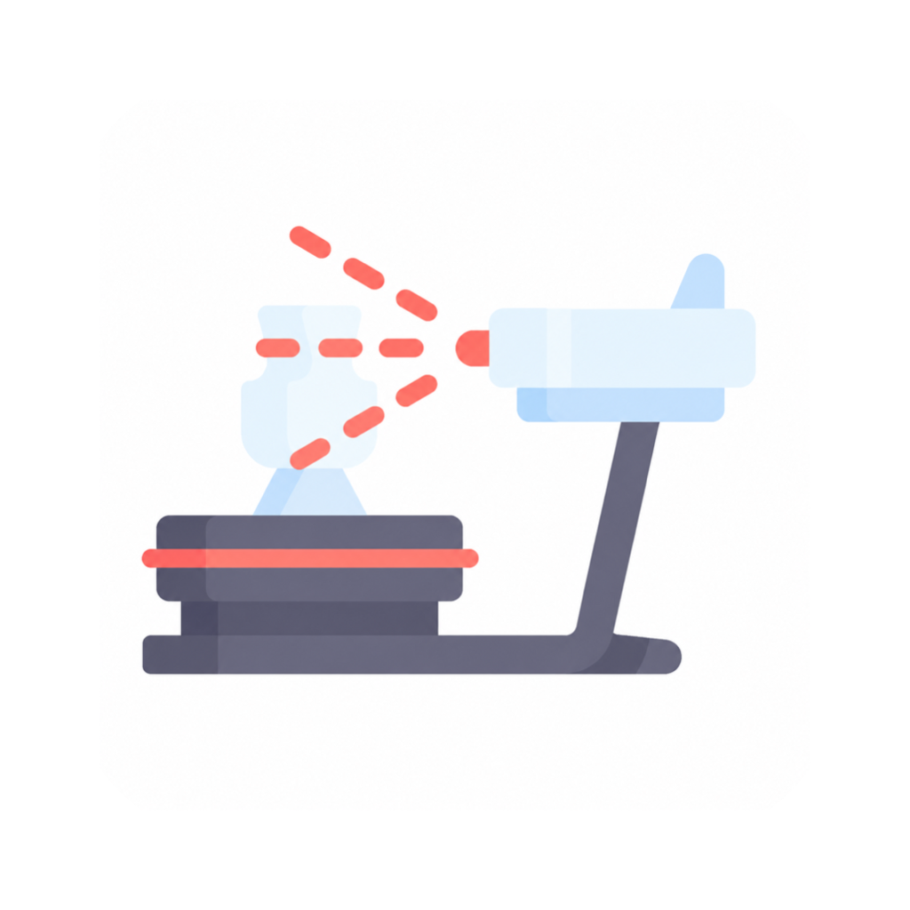

# ScanMerge



[English](README.md)

ScanMerge dopasowuje ujęcia EXScanS na Macach z Apple Silicon i zapisuje wynik jako projekt EXScanS. Opcjonalny eksport PLY tworzy pojedynczą chmurę punktów do otwarcia w CloudCompare i innych programach 3D.

- Automatyczne dopasowanie wielu ustawień przedmiotu i ujęć z obrotnicy.
- Zachowanie wszystkich zmierzonych punktów i oryginalnej skali.
- Aplikacja okienkowa z podglądem postępu i możliwością anulowania.
- Obsługa z Terminala do przetwarzania wsadowego i integracji.
- Polski interfejs przy polskim języku systemu; angielski w pozostałych przypadkach.

## Wymagania

- Mac z Apple Silicon i macOS 13 lub nowszym.
- EXScanS **3.2.0.4 ARM64**, zainstalowany w `/Applications/EXScanS.app`.

ScanMerge obsługuje konkretny wariant biblioteki natywnej EXScanS i sprawdza zgodność przed rozpoczęciem pracy. Inne wersje biblioteki są odrzucane. Szczegóły techniczne: [Native adapter](docs/DEVELOPMENT.md#native-adapter).

## Pierwsze kroki

Pobierz `ScanMerge-1.0.0-macOS-arm64.zip` z sekcji [Releases](https://github.com/supczinskib/scanmerge/releases).

1. Rozpakuj archiwum aplikacji i skopiuj `ScanMerge.app` do Aplikacji.
2. Otwórz ScanMerge i wybierz katalog ze skanami.
3. Wybierz miejsce zapisu i wpisz nazwę nowego katalogu wyniku.
4. W razie potrzeby zaznacz **Zapisz także połączoną chmurę PLY**.
5. Kliknij **Połącz skany**.

W EXScanS otwórz plik `EXScanS/merged.sln_fix` z katalogu wyniku. Zachowaj cały katalog `EXScanS`: plik rozwiązania odwołuje się do znajdujących się obok plików projektów i ujęć.

### Pierwsze uruchomienie w macOS

Wersja 1.0.0 ma podpis lokalny ad hoc, bez podpisu Developer ID i notaryzacji Apple. Jeśli macOS zablokuje aplikację, najpierw spróbuj ją otworzyć, a następnie przejdź do **Ustawienia systemowe → Prywatność i ochrona → Otwórz mimo to** i potwierdź. Zobacz [instrukcję Apple](https://support.apple.com/pl-pl/guide/mac-help/mh40616/mac).

## Terminal

W sekcji Terminala w aplikacji kliknij **Włącz polecenie w Terminalu**, a następnie otwórz nowe okno Terminala:

```sh
scanmerge "/ścieżka/do/skanów" "/ścieżka/do/wyniku" --ply
```

Pomiń `--ply`, aby zapisać tylko projekt EXScanS i raporty diagnostyczne. Katalog wyjściowy musi być nowy albo pusty i oddzielony od wejściowego. Pliki źródłowe zostają zachowane. Ctrl-C anuluje pracę.

Polecenie jest też dostępne bezpośrednio wewnątrz aplikacji:

```sh
/Applications/ScanMerge.app/Contents/MacOS/scanmerge "/ścieżka/do/skanów" "/ścieżka/do/wyniku"
```

Integracja z Terminalem tworzy skrót `~/.local/bin/scanmerge` i dodaje go do ścieżki wyszukiwania poleceń. Po przeniesieniu aplikacji wybierz **Odśwież polecenie w Terminalu**. Przycisk **Wyłącz polecenie w Terminalu** usuwa integrację.

Lista opcji: `scanmerge --help`. Informacje o automatyzacji: [CLI integration](docs/DEVELOPMENT.md#cli-integration).

## Obsługiwane pliki

Katalog wejściowy musi zawierać rozwiązanie `.sln_fix` wraz ze wskazanymi plikami `.fix_prj` i `.rge` albo zestaw projektów `.fix_prj` z ich ujęciami. Liczby ujęć i początkowe położenia są odczytywane z danych projektu, w tym plików RGE. Liczba kroków obrotnicy nie jest ustalona na sztywno.

| Wynik | Opis |
| --- | --- |
| `EXScanS/merged.sln_fix` | Rozwiązanie otwierane w EXScanS |
| `EXScanS/*.fix_prj` i `EXScanS/*.rge` | Wymagane dane projektów i ujęć |
| `merged.ply` | Opcjonalna połączona chmura punktów z normalnymi, w milimetrach |
| Raporty JSON i `progress.jsonl` | Diagnostyka dopasowania, transformacje i czasy przetwarzania |

Projekt EXScanS zachowuje osobne ujęcia ze zaktualizowanymi położeniami. PLY zawiera połączoną chmurę punktów. Raporty nie są wymagane do przeglądania wyniku.

## Dopasowanie

ScanMerge zmienia obrót i przesunięcie ujęć, zachowując oryginalne pomiary. Przed zakończeniem zapisu sprawdza dane wynikowych RGE i odwołania do plików projektu.

Ujęcia muszą przedstawiać wspólne fragmenty tego samego przedmiotu. Małe pokrycie, symetria i powtarzalne elementy mogą powodować niejednoznaczność dopasowania. Łączenie zachowuje szum pomiarowy skanera; odtwarzanie powierzchni i edycja siatki to osobne etapy obróbki. Przed dalszym przetwarzaniem sprawdź wynik. Uruchomienie Global Optimization w EXScanS może zmienić dopasowanie.

## Rozwój projektu

Kompilacja wymaga Xcode z SDK macOS:

```sh
./build-gui.sh
```

Aplikacja powstaje w `dist/ScanMerge.app`. Polecenie `./build.sh` buduje sam silnik i narzędzie do Terminala.

- [Architektura i integracja](docs/DEVELOPMENT.md)
- [Testy](docs/TESTING.md)
- [Opcjonalny podpis Developer ID i notaryzacja](release/README.md)
- [Publikowanie wydania na GitHubie](docs/PUBLISHING.md)
- [Informacje o zależnościach](THIRD_PARTY_NOTICES.md)

ScanMerge jest niezależnym projektem, niepowiązanym z SHINING 3D.

## Licencja

Kod źródłowy ScanMerge jest dostępny na licencji [GNU General Public License v3.0](LICENSE) (`GPL-3.0-only`). Zależności podlegają własnym licencjom, opisanym w [THIRD_PARTY_NOTICES.md](THIRD_PARTY_NOTICES.md).
